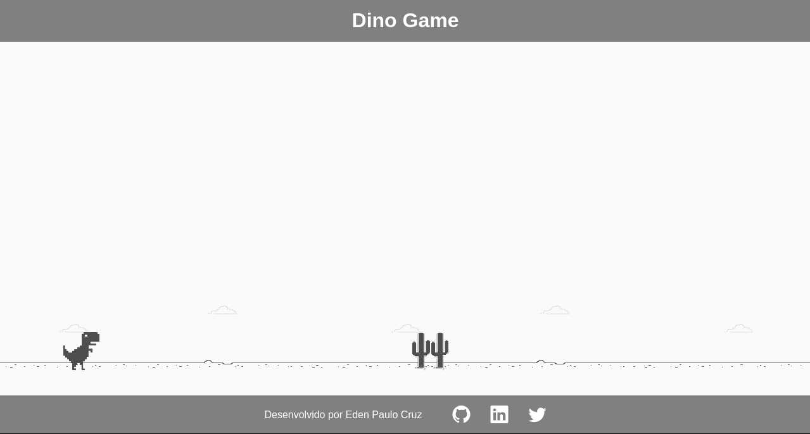

# Dino Game

## Descrição

Neste projeto o desafio foi criar uma cópia do jogo do dinossauro, famoso no Chrome por nos entreter quando estamos sem conexão. Nele foi utilizado HTML, CSS e JavaScript, abordando de maneira simples diversos conceitos introdutórios importantes para programação na web como tags básicas de HTML, manipulação de eventos, funções e manipulação de elementos HTML usando JavaScript, estilização e animações básicas com CSS.

O projeto teve a mentoria do [Celso Henrique](https://github.com/celso-henrique).

## Como executar

O projeto está publicado no GitHub Pages e poderá ser acessado [neste link](https://edenpaulocruz.github.io/dino-game/).

Também poderá ser executado localmente, sendo necessário o downoload/clone do repositório e abir o arquivo `index.html` no navegador preferido.